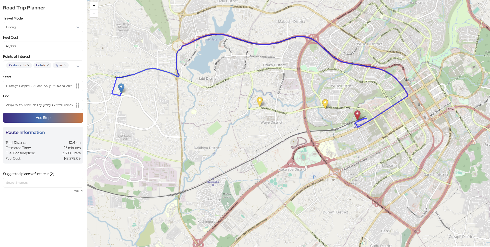
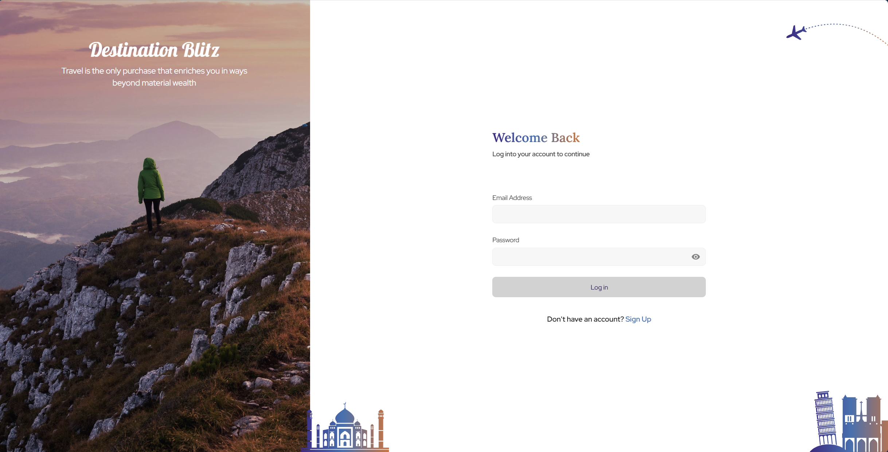

# Destination Blitz Minimal Starter

## Description

This project is built on vue.js (Nuxt3) and uses Leaflet and Open Street Map to display and manipulate map data as well as OSRM for GeoJson, Polyline draw and route calculations.

Look at the [Nuxt 3 documentation](https://nuxt.com/docs/getting-started/introduction) to learn more.

## Requirement

- Node 20+
- Npm

## Setup

Make sure to install the dependencies first:

```bash
# npm
npm install

# pnpm
pnpm install

# yarn
yarn install

# bun
bun install
```

## Development Server

Start the development server on `http://localhost:3000`:

```bash
# npm
npm run dev

# pnpm
pnpm run dev

# yarn
yarn dev

# bun
bun run dev
```

## Production

Build the application for production:

```bash
# npm
npm run build

# pnpm
pnpm run build

# yarn
yarn build

# bun
bun run build
```

Locally preview production build:

```bash
# npm
npm run preview

# pnpm
pnpm run preview

# yarn
yarn preview

# bun
bun run preview
```

## Visuals






## Structure

```
Root/
├── assets/
├── components/
├── composables/
├── layouts/
├── libs/
├── pages/
├── plugins/
├── public/
│   ├── images/
│   ├── svgs/
│   └── screenshort1.png
├── server/
├── stores/
├── types/
├── utils/
└── README.md
```

Visit the [deployment](https://destination-blitz.netlify.app/) for a live preview.
